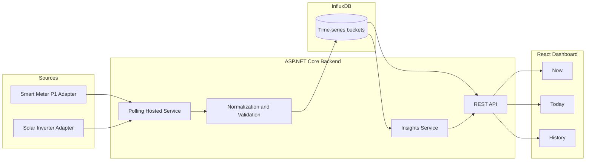

# Architecture

## High-level diagram (text)

## Data flow

1. Polling service runs every 5-30 seconds for realtime metrics.
2. Smart meter adapter returns electricity import/export and gas readings.
3. Inverter adapter returns live generation and optional historical production.
4. Data is normalized into one unified sample and stored in InfluxDB.
5. API reads current snapshots and range aggregates (hour/day/month).
6. Insight service computes simple statements such as daily usage and solar coverage.
7. React dashboard renders Now, Today, and History sections.

## Core domain model

- InstantSample:
  - timestamp
  - electricityImportW
  - electricityExportW
  - solarProductionW
  - gasFlowM3h
  - netGridW
- DailySummary:
  - date
  - usedKwh
  - producedKwh
  - importedKwh
  - exportedKwh
  - gasM3
  - solarCoveragePct

## Adapter contracts

- ISmartMeterAdapter:
  - GetRealtimeAsync()
  - GetDailyTotalsAsync(date)
- ISolarInverterAdapter:
  - GetRealtimeAsync()
  - GetHistoryAsync(from,to,granularity)

These interfaces allow easy brand-specific implementations (SMA, Enphase, future brands).

## Tradeoffs

- Polling vs streaming:
  - Polling is simpler, robust, and easy to debug for home setups.
  - Streaming is lower-latency but adds complexity and coupling.
  - For this project, polling is preferred.
- InfluxDB vs TimescaleDB:
  - InfluxDB is easier for time-window queries and retention policies.
  - TimescaleDB is stronger if relational joins become dominant.
  - Current needs fit InfluxDB best.
- Monolith vs microservices:
  - Single backend process keeps operations simple and reliable.
  - Split services can be added later if needed.

## Security and reliability

- Local network only for source adapters.
- Backend and DB only exposed to local Docker network where possible.
- Secrets from environment variables.
- Graceful retries and timeout handling in adapters.
- Clear logs for failed source polls.
